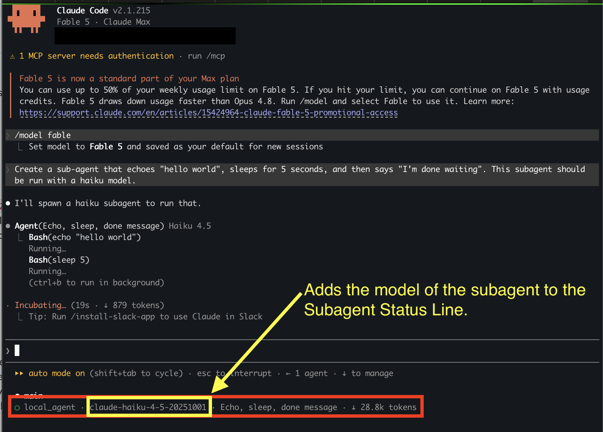

# Subagent Status Line: Show the Model of Each Subagent

By default, Claude Code's subagent status line doesn't tell you **which model** each subagent is running on. With a small custom status line script, you can see the model, task description, and token usage for every running subagent at a glance.



In the screenshot above, the status line shows the subagent is running `claude-haiku-4-5-20251001` — useful when you're delegating cheap tasks to Haiku while your main session runs a more capable model.

## What You Get

Each subagent's status line will show:

```
local_agent · claude-haiku-4-5-20251001 · Echo, sleep, done message · ↓ 28.8k tokens
```

- **Type** of the subagent (e.g., `local_agent`)
- **Model** the subagent is running on
- **Description** of the task
- **Token count**, nicely formatted (e.g., `28.8k`)

## Setup

**Requirements:** [`jq`](https://jqlang.github.io/jq/) must be installed (`brew install jq` on macOS).

### 1. Add the script

Copy [`subagent-statusline.sh`](subagent-statusline.sh) to `~/.claude/subagent-statusline.sh` and make it executable:

```bash
cp subagent-statusline.sh ~/.claude/subagent-statusline.sh
chmod +x ~/.claude/subagent-statusline.sh
```

### 2. Configure Claude Code

Add this key to your `~/.claude/settings.json`:

```json
  "subagentStatusLine": {
    "type": "command",
    "command": "~/.claude/subagent-statusline.sh"
  },
```

### 3. Try it out

Start a new Claude Code session and ask it to spawn a subagent, for example:

```
Create a sub-agent that echoes "hello world", sleeps for 5 seconds, and then
says "I'm done waiting". This subagent should be run with a haiku model.
```

While the subagent runs, you'll see its model in the status line at the bottom of your terminal.

## How It Works

Claude Code pipes JSON describing the running subagent tasks to the command configured in `subagentStatusLine`. The script uses `jq` to transform each task into a `{id, content}` object, where `content` is the text rendered in the status line. That means you can customize the format however you like — reorder fields, add emoji, drop the token count, etc.
