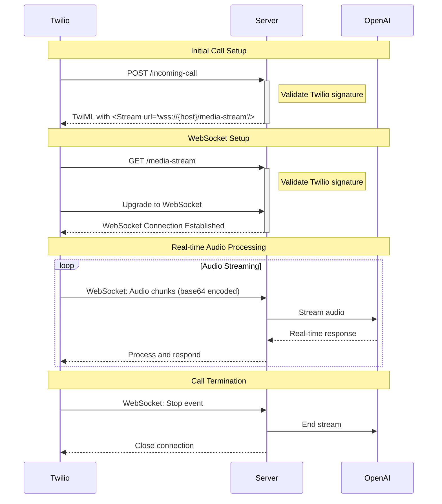

# Twilio + OpenAI Real-time Audio Processing

This project demonstrates real-time audio processing using Twilio's Media Streams API and OpenAI Realtime API. It allows for real-time interaction with a caller and OpenAI's Realtime API.

## Features

- Real-time audio streaming from Twilio phone calls
- WebSocket handling for Twilio Media Streams
- Secure request validation for Twilio webhooks
- Integration with OpenAI's APIs
- Tool usage for AI agents
- Docker containerization for easy deployment

## Prerequisites

- Docker and Docker Compose
- Twilio Account and credentials
- OpenAI API key
- ngrok

## Architecture




## Core Components

### FastAPI Application ([twilio_openai/main.py](twilio_openai/main.py))
- HTTP Endpoints:
  - `/incoming-call`: Handles initial Twilio webhook and returns TwiML with a WebSocket URL
- WebSocket Endpoint:
  - `/media-stream`: Handles real-time audio streaming

### Adapters ([twilio_openai/adapters/](twilio_openai/adapters/))
- `TwilioOpenAIAdapter`: Bridges communication between Twilio and OpenAI
  - Handles message format translation between services
  - Manages WebSocket stream state
  - Processes base64 encoded audio packets
  - Tracks stream statistics and health
  - Implements error handling and graceful termination

### Protocols ([twilio_openai/protocols/](twilio_openai/protocols/))
- [websocket_adapter.py](twilio_openai/protocols/websocket_adapter.py): Base protocol for WebSocket communication
  - Defines interface for message processing
  - Specifies connection lifecycle methods
  - Establishes error handling patterns
- [websocket_bridge.py](twilio_openai/protocols/websocket_bridge.py): Bidirectional WebSocket bridge
  - Connects and manages two WebSocket connections
  - Handles message routing between connections
  - Implements backpressure handling
  - Manages connection lifecycle synchronization
  - Provides error propagation between connections

### Services ([twilio_openai/services/](twilio_openai/services/))
- [openai_service.py](twilio_openai/services/openai_service.py): OpenAI integration
  - Manages API authentication
  - Sets up WebSocket connection
  - Configures OpenAI model, voice, and prompt
  - Implements the initial greeting
- [twilio_service.py](twilio_openai/services/twilio_service.py): Twilio integration
  - Generates TwiML responses
  - Sets up WebSocket connection

## Environment Variables

### Server Settings
- `HOST`: Server binding address (default: `0.0.0.0`)
- `PORT`: Server port number (default: `5001`)
- `LOG_LEVEL`: Logging level: debug, info, warning, error, critical (default: `info`)
- `RELOAD`: Enable auto-reload for development (default: `false`)

### Ngrok Settings
- `NGROK_URL`: Optional custom domain for ngrok (if not set, ngrok will use random URL)

### Performance Tuning
- `LIMIT_CONCURRENCY`: Maximum number of concurrent connections (default: `1000`)
- `BACKLOG`: Maximum length of queue of pending connections (default: `2048`)
- `TIMEOUT_KEEP_ALIVE`: Seconds to hold keep-alive connections open (default: `5`)

### WebSocket Settings
- `WS_PING_INTERVAL`: How often to ping WebSocket clients in seconds (default: `30`)
- `WS_PING_TIMEOUT`: How long to wait for pong response in seconds (default: `30`)
- `WS_MAX_SIZE`: Maximum WebSocket message size in bytes (default: `1048576` (1MB))
- `WS_MAX_QUEUE`: Maximum number of messages to queue per client (default: `64`)

### Required Variables

```bash
TWILIO_ACCOUNT_SID=your_account_sid # Your Twilio Account SID
TWILIO_AUTH_TOKEN=your_auth_token # Your Twilio Auth Token
OPENAI_API_KEY=your_openai_key # Your OpenAI API Key
```

### Server Configuration


## Getting Started

1. Clone the repository:
```bash
git clone https://github.com/relayhawk/sample-code.git
cd sample-code/twilio-openai-realtime
```

2. Set up environment variables:
```bash
cp .env.example .env
# Edit .env with your credentials
```

3. Start the application:
```bash
docker-compose up --build
```

4. Get the ngrok Base URL:
* In your browser, go to [http://localhost:4040/](http://localhost:4040/status) and find the URL

5. Configure your Twilio number:
  * Twilio Console -> Phone Numbers -> Manage -> Active Numbers -> [Select your number] 
  * Set Voice Configuration to
    * Configure with `Webhook, TwiML Bin, ...`
    * A Call comes in > Webhook
    * Webhook URL > `https://your-ngrok-url/incoming-call`

6. Make a call to your Twilio number and start talking!

## Development

### Running Tests

```bash
docker-compose -f docker-compose.test.yml up
```

### Debugging

The application includes detailed logging for troubleshooting:
- Twilio signature validation
- WebSocket connections
- Audio processing events

### Common Issues

1. Invalid Twilio signatures:
   - Check the env var `TWILIO_AUTH_TOKEN` matches the one in your Twilio account

2. Other issues:
   - You can enable debug logging with the environment variable `LOG_LEVEL=debug` in the `docker-compose.yml` file
   - You can review the HTTP requests and responses in the ngrok dashboard [http://localhost:4040/](http://localhost:4040/)

## Contributing

1. Fork the repository
2. Create a feature branch
3. Commit your changes
4. Push to the branch
5. Create a Pull Request

## License

To be determined. 

## References

- Twilio Blog - [Build an AI Voice Assistant with Twilio Voice, OpenAI’s Realtime API, and Python](https://www.twilio.com/en-us/blog/voice-ai-assistant-openai-realtime-api-python)
- [OpenAI Realtime API](https://platform.openai.com/docs/guides/realtime)
